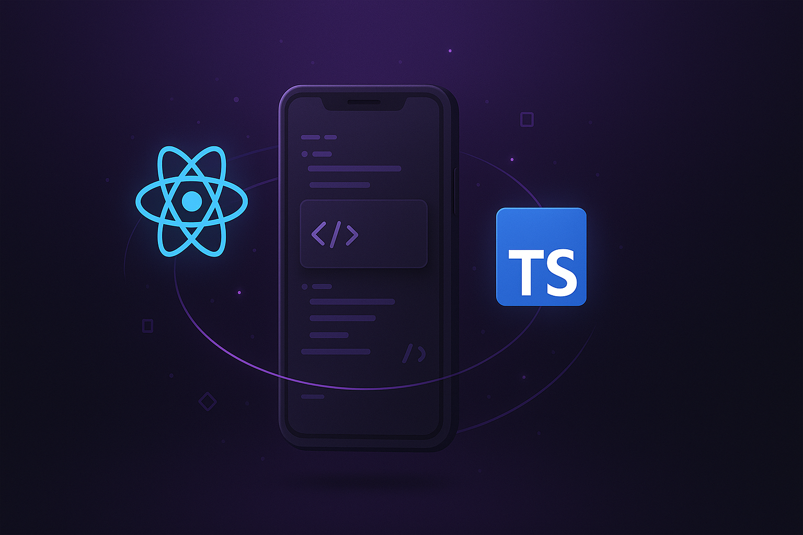

# Repositório de Cursos Rocketseat

Este repositório contém projetos desenvolvidos durante os diversos cursos da Rocketseat. Aqui você encontrará aplicações que abrangem diferentes tecnologias e conceitos, desde níveis básicos até avançados, organizados por trilha de aprendizado.

## React Native

Projetos desenvolvidos durante a trilha de React Native, focados na criação de aplicações nativas para iOS e Android utilizando JavaScript/TypeScript.

| Projeto                      | Descrição/Tópicos                                                                                                                                | Tecnologia                                                                                                                                                                                                                                                                                  |
| ---------------------------- | ------------------------------------------------------------------------------------------------------------------------------------------------ | ------------------------------------------------------------------------------------------------------------------------------------------------------------------------------------------------------------------------------------------------------------------------------------------- |
| [comprar-app](./comprar-app) | Aplicativo de lista de compras. Aborda conceitos de gerenciamento de estado, componentes funcionais e estilização com StyleSheet.                | React Native                                                                                                                                                    |
| [igniteteams](./igniteteams) | Aplicativo para gerenciamento de times. Aborda navegação, armazenamento local, hooks personalizados e temas.                                     | React Native  TypeScript  |
| [ignite-todo](./ignite-todo) | Aplicativo de lista de tarefas. Foca em manipulação de estado, CRUD completo e formulários.                                                      | React Native  TypeScript  |
| [imhere](./imhere)           | Aplicativo de controle de presença. Introduz os conceitos básicos do React Native, componentes e estado.                                         | React Native                                                                                                                                                    |
| [navigation](./navigation)   | Projeto focado em implementação de navegação entre telas usando React Navigation. Aborda diferentes tipos de navegação como Stack, Tab e Drawer. | React Native  TypeScript  |

Cada projeto explora diferentes aspectos do desenvolvimento e representa um avanço progressivo na complexidade e uso de recursos das tecnologias.

## Next.js

Projetos desenvolvidos utilizando Next.js, framework React para produção que oferece renderização híbrida, roteamento automático e otimizações de performance.

| Projeto                    | Descrição/Tópicos                                                                                                               | Tecnologia                                                                                                                                                                                                                                                                                    |
| -------------------------- | ------------------------------------------------------------------------------------------------------------------------------- | --------------------------------------------------------------------------------------------------------------------------------------------------------------------------------------------------------------------------------------------------------------------------------------------- |
| [site-blog](./site-blog)   | Projeto de blog desenvolvido durante curso da Rocketseat. Explora conceitos fundamentais do Next.js incluindo SSG, roteamento e componentes React. | Next.js  TypeScript  |

## Futuras Trilhas

Conforme eu avançar em outros cursos da Rocketseat, novas seções serão adicionadas aqui com seus respectivos projetos.
